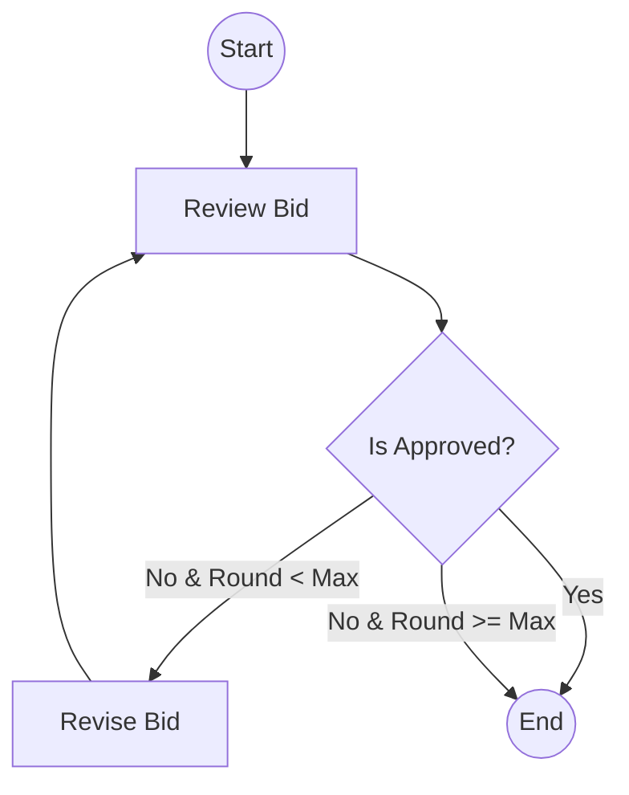

# System Architecture

## Overview
IT Bidding Copilot is an agentic system designed to automate the IT bidding process. It leverages **CrewAI** for multi-agent collaboration and **LangGraph** for structured, stateful workflows.

## Core Components

### 1. Multi-Agent System (CrewAI)
The system uses specialized agents to handle different aspects of the bidding process:
- **Bid Analyst**: Extracts requirements from RFP.
- **Commercial Specialist**: Handles compliance and business qualifications.
- **Technical Architect**: Designs the technical solution.
- **Chief Reviewer**: Conducts rigorous quality control.

### 2. Intelligent Workflow (LangGraph)
The review process is managed by a state machine that ensures iterative improvement:

### 3. Knowledge Base (RAG)
The system integrates a RAG (Retrieval-Augmented Generation) pipeline using:
- **FAISS**: Vector database for efficient semantic search.
- **OpenAI Embeddings**: Converts documents into high-dimensional vectors.
- **Knowledge Sources**: Corporate history, past bids, and certification documents.

## Data Flow
1. **Input**: User uploads RFP (PDF/Word).
2. **Analysis**: `Bid Analyst` extracts a structured requirement list.
3. **Generation**: `Commercial Specialist` and `Technical Architect` generate response drafts using the RAG knowledge base.
4. **Review Loop**: `LangGraph` orchestrates the `Chief Reviewer` to iterate on the draft until it meets compliance and quality standards.
5. **Output**: System exports a finalized Word document using `docx_exporter`.

## Configuration
- **Max Review Rounds**: Configurable in `config.py` (default: 3).
- **LLM Selection**: Supports various models through LangChain integration.
- **Embeddings**: Optimized for technical and legal Chinese/English text.
